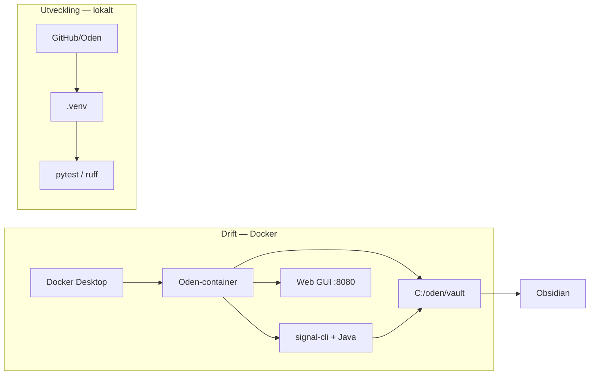

# Setup-guide — Windows (Docker + utveckling)

Levande guide för att sätta upp Oden på Windows. Utgår från [SETUP_FLOW.md](./SETUP_FLOW.md) och kompletterar [WINDOWS_SETUP.md](./WINDOWS_SETUP.md) med utvecklingsmiljö och anteckningar under faktisk setup.

**Vald väg:** Docker Compose (1B) för drift + lokal Python-venv för kod och tester.

---

## Status

Uppdatera checklistan allteftersom stegen genomförs.

### Förutsättningar (manuell installation)

- [x] Docker Desktop installerat och igång
- [x] Obsidian installerat
- [x] Signal på mobil (QR-länkning)
- [x] Signal Desktop (valfritt, grupphantering)

### Drift (Docker)

- [x] Mapp `C:\oden` skapad med `docker-compose.yml` och `vault/`
- [x] Container startad (`docker compose up -d`)
- [x] Setup-wizard genomförd på http://localhost:8080/setup
- [x] Signal-konto länkat via QR
- [x] Vault öppnat i Obsidian (`C:\oden\vault`)
- [x] Obsidian Map View-plugin installerat och aktiverat

### Utveckling (lokal Python)

- [x] Python 3.14 verifierat
- [x] Virtual environment (`.venv`) skapat och aktiverat
- [x] `pip install -e ".[tray]"` + dev-verktyg
- [x] `pytest -q` — 235 passed, 1 Windows-specifikt test fail (sökvägsformat)
- [x] Pre-commit hooks installerade

---

## Översikt



| Del | Syfte | Delar state med drift? |
|-----|-------|------------------------|
| Docker (1B) | Köra appen, ta emot Signal → Markdown | Ja — config i Docker-volym, vault i `C:\oden\vault` |
| Python-venv (2) | Tester, kodändringar, lint | Nej — oberoende av containern |

---

## Del 1: Köra appen med Docker

Se även [WINDOWS_SETUP.md](./WINDOWS_SETUP.md) för volymhantering, felsökning och avinstallation.

### Förutsättningar

| Program | Varför | Installeras manuellt? |
|---------|--------|------------------------|
| [Docker Desktop](https://www.docker.com/products/docker-desktop/) | Kör Oden-containern (Java + signal-cli ingår) | Ja — kräver WSL 2, kan behöva omstart |
| [Obsidian](https://obsidian.md/download) | Läsa rapporter i vault | Ja |
| Signal (mobil) | QR-länkning i setup-wizard | Ja (redan på telefon) |
| [Signal Desktop](https://signal.org/download/) | Grupphantering (valfritt) | Ja |

Verifiera att Docker kör innan du fortsätter:

```powershell
docker --version
docker compose version
```

### Steg 1 — Skapa mapp och starta

```powershell
mkdir C:\oden
cd C:\oden
Invoke-WebRequest -Uri "https://raw.githubusercontent.com/NicklasAndersson/oden/main/docker-compose.yml" -OutFile "docker-compose.yml"
mkdir vault
docker compose up -d
```

Första starten laddar ned imagen (~500 MB). Java/signal-cli behöver ofta 10–20 sekunder innan webbgränssnittet svarar.

### Steg 2 — Setup-wizard

Öppna **http://localhost:8080/setup**.

| Steg | Vad du anger | Kommentar |
|------|--------------|-----------|
| 1. Hemkatalog | `/data` | Container-intern sökväg — ändra inte. Windows-plats styrs av `volumes:` i `docker-compose.yml` |
| 2. Signal-konto | Skanna QR | *Inställningar → Länkade enheter → Lägg till enhet*. **60 sek timeout** — ha Signal-appen öppen innan du startar |
| 3. Vault + visningsnamn | `/vault` + valfritt namn | **Ändra** förifylld `/root/oden-vault` till `/vault`. Mappas till `C:\oden\vault` på Windows |
| 4. Obsidian-mall | Rekommenderat första gången | Installerar `.obsidian/` med Map View-plugin. Skriver inte över befintlig `.obsidian/` |

Detaljer om varje steg: [SETUP_FLOW.md](./SETUP_FLOW.md).

> **Signal:** Använd ett dedikerat nummer — inte ditt privata. Länka till befintligt konto (rekommenderat), registrera inte nytt nummer utan telefon.

### Steg 3 — Obsidian och Map View

1. Obsidian → **Open folder as vault** → `C:\oden\vault`
2. Rapporter dyker upp per grupp när meddelanden tas emot (en undermapp per Signal-grupp)

**Map View-plugin** (för kartor) — två sätt att få det:

| Sätt | När |
|------|-----|
| **Setup-wizard steg 4** | Obsidian-mall kopierar `obsidian-template/` till vault (inkl. Map View) |
| **Manuellt** | Obsidian → *Settings → Community plugins → Browse* → sök **Map View** → Install → Enable |

Plugin: [obsidian-map-view](https://github.com/esm7/obsidian-map-view). Verifiera att `C:\oden\vault\.obsidian\community-plugins.json` innehåller `"obsidian-map-view"`.

**Använda kartan:**

- Oden skriver `[Position](geo:lat,lon)` i rapportfiler när meddelandet innehåller en kartlänk (Google/Apple/OSM), Signals platsdelning, eller MGRS i fältet `Ställe:` (7S-rapporter)
- Klicka på geo-länken i en rapport — Map View öppnar platsen
- Alternativt: kommandopaletten (`Ctrl+P`) → sök **Map View** för att öppna kartvyn

Se avsnitt [Positioner och kartor](#positioner-och-kartor) nedan.

### Steg 4 — Dashboard och config

**http://localhost:8080** — config, loggar, grupper, mallar, Signal-konton, autosvar (`#help`).

**Viktigt efter setup:** kontrollera **Grupper**-fliken. Ignorerade grupper och whitelist styr vilka meddelanden som sparas. Om `whitelist_groups` är satt sparas **endast** de grupperna — alla andra hoppas över (prioritet över ignore-listan). Se [FEATURES.md](./FEATURES.md).

### Vanliga Docker-kommandon

Kör från `C:\oden`:

```powershell
docker compose ps          # status
docker compose logs -f     # loggar
docker compose stop        # stoppa
docker compose up -d       # starta igen
docker compose pull        # hämta ny image
docker compose up -d       # starta med ny image
docker compose restart     # om QR-kod inte dyker upp direkt
```

### Anpassa sökvägar (valfritt)

Redigera `volumes:` i `docker-compose.yml` — container-sökvägarna `/data` och `/vault` ska vara oförändrade. Exempel:

```yaml
volumes:
  - C:/oden-config:/data
  - D:/Obsidian/Rapporter:/vault
```

---

## Del 2: Lokal Python-miljö

För kod, tester och lint — körs i repot, inte i Docker.

### Förutsättningar

- Python 3.10+ (`python --version`)
- Git (repot redan klonat)

### Steg

```powershell
cd "C:\Users\Gustav Träff\GitHub\Oden"
python -m venv .venv
.venv\Scripts\Activate.ps1

pip install -e ".[tray]"
pip install pytest pytest-cov ruff pre-commit
pre-commit install

pytest -q
ruff check . && ruff format .
```

Förväntat: ~239 tester på ca 10 sekunder (1 Windows-specifikt path-test kan faila lokalt — påverkar inte Docker-drift).

> **Obs:** Kör inte `python -m oden` parallellt med Docker — då får du två instanser. Använd Docker för drift och venv för tester.

På PowerShell (äldre versioner saknar `&&`):

```powershell
ruff check .
ruff format .
```

---

## Positioner och kartor

Oden extraherar koordinater från **kartlänkar** och **MGRS i `Ställe:`** (7S-rapporter) — inte från fria koordinater eller adresser. Detaljer: [FEATURES.md — Platsextraktion](./FEATURES.md#platsextraktion).

### Vad som fungerar i Signal

| Input | Resultat |
|-------|----------|
| Signals **platsdelning** | Fungerar — Signal bifogar en kartlänk som Oden tolkar |
| Google Maps-länk | `https://maps.google.com/maps?q=59.51,17.76` (eller `%2C` mellan lat/lon) |
| Apple Maps-länk | `https://maps.apple.com/?q=...` eller `?ll=...` |
| OpenStreetMap-länk | `?mlat=...&mlon=...` eller `#map=zoom/lat/lon` |
| MGRS i `Ställe:` | `Ställe: 33VWE 64874 95103, Fiskebyvägen` → konverteras till WGS84 |
| Bara text `"59.51, 17.76"` | **Fungerar inte** |
| Bara gatuadress (utan MGRS) | **Fungerar inte** |

### Vad som skrivs i rapportfilen

```markdown
[Position](geo:59.514828,17.767852)
```

Länken skapas av mallen `report.md.j2`. Original-URL:en finns kvar under **## Meddelande**. Se [REPORT_TEMPLATE.md](./REPORT_TEMPLATE.md).

### 7s-rapporter — innehåll, inte format

Oden kräver inget fast formulär för rapporttext. Innehållsriktlinjer (de 8 S:en) finns i autosvaret på `#help` i Signal. Redigera texten under dashboard → **Svar**. Mer: [FEATURES.md — Kommandon & autosvar](./FEATURES.md#kommandon--autosvar).

---

## Bilagor (bilder)

Bilder i **samma Signal-meddelande** som text sparas tillsammans i en rapport:

- Filer hamnar i `vault/{grupp}/{timestamp}_{avsändare}/1_bild.jpg` …
- Markdown-filen får Obsidian-embeds under **## Bilagor**: `![[undermapp/1_bild.jpg]]`
- Meddelande med **enbart bild** (ingen text) sparas också

Meddelanden som börjar med `--` sparas inte. `#help` / `#ok` triggar autosvar men skapar ingen fil.

---

## Del 3: Utvecklingsflöde

1. `pytest -q`
2. `ruff check . && ruff format .`
3. Feature-branch → PR mot `main`
4. CI bygger snapshot vid merge (Docker-image + ev. Windows `.exe`)
5. Uppdatera drift:

```powershell
cd C:\oden
docker compose pull
docker compose up -d
```

---

## Alternativ: Native Windows-installer

Om Docker inte passar (t.ex. distribution till andra utan Docker): ladda ned `Oden-Setup-x.y.z-x64.exe` från [releases](https://github.com/NicklasAndersson/oden/releases/latest).

- Ingen Docker/WSL
- Tray-ikon, autostart via Start-menyn
- SmartScreen kan kräva *Mer information → Kör ändå* (osignerad build)

Se [WINDOWS_NATIVE_PLAN.md](./WINDOWS_NATIVE_PLAN.md) för teknisk bakgrund.

---

## Rekommenderad programvara

| Program | Syfte |
|---------|-------|
| Signal Desktop | Administrera grupper |
| Obsidian | Läsa rapporter |
| [Obsidian Map View](https://github.com/esm7/obsidian-map-view) | Karta för geo-positioner i rapporter |
| [Syncthing](https://syncthing.net/downloads/) | Synka vault mellan enheter |

---

## Anteckningar under setup

Uppdatera den här sektionen när vi sätter upp — datum, vad som fungerade, avvikelser från guiden.

### 2026-05-23

- **Förutsättningar klara:** Docker Desktop, Obsidian, Signal (mobil + desktop).
- **Vald väg:** Docker Compose (1B) + lokal venv för utveckling.
- **Docker:** `C:\oden` skapad, container körs, setup-wizard genomförd.
- **Config:** vault `/vault` → `C:\oden\vault`, hemkatalog `/data`, timezone `Europe/Stockholm`, `filename_format: tnr`.
- **Vault-sökväg i wizard:** ändrad från förifylld `/root/oden-vault` till `/vault`.
- **Grupper:** whitelist satt (`Uppfinnarjocke`) — endast whitelistsade grupper sparas tills config ändras.
- **Obsidian:** vault öppnad, Map View-plugin installerat (`community-plugins.json` verifierad).
- **Python-venv:** `.venv` i repot, 235/236 tester gröna (1 Windows path-test failar lokalt).

---

## Relaterad dokumentation

- [WINDOWS_SETUP.md](./WINDOWS_SETUP.md) — Docker för slutanvändare (felsökning, autostart)
- [SETUP_FLOW.md](./SETUP_FLOW.md) — Setup-wizard i detalj
- [FEATURES.md](./FEATURES.md) — Funktioner, gruppfilter, platsextraktion, append-läge
- [REPORT_TEMPLATE.md](./REPORT_TEMPLATE.md) — Markdown-mallar och placeholders
- [WEB_GUI.md](./WEB_GUI.md) — Dashboard och API
- [README.md](../README.md) — Översikt och utvecklingskommandon
