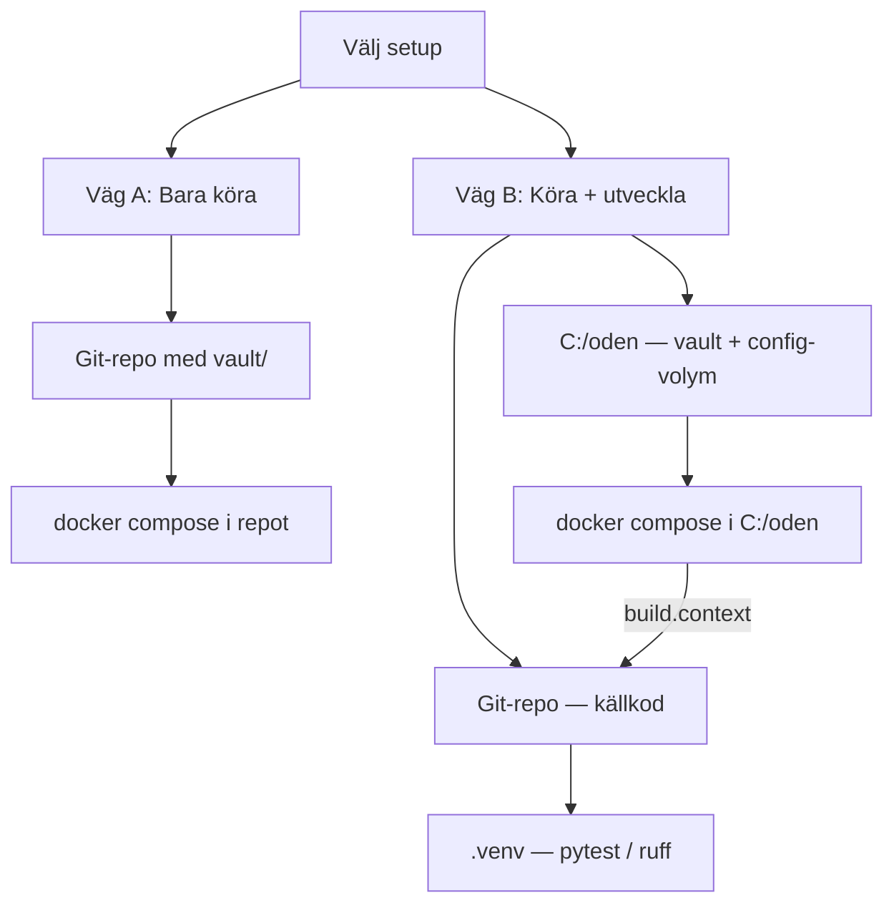

# Setup-guide — Windows (Docker)

Levande guide för att sätta upp Oden på Windows. Utgår från [SETUP_FLOW.md](./SETUP_FLOW.md) och kompletterar [WINDOWS_SETUP.md](./WINDOWS_SETUP.md) med val av driftupplägg och (valfritt) utvecklingsmiljö.

---

## Status

Uppdatera checklistan allteftersom stegen genomförs.

### Förutsättningar (manuell installation)

- [x] Docker Desktop installerat och igång
- [x] Obsidian installerat
- [x] Signal på mobil (QR-länkning)
- [x] Signal Desktop (valfritt, grupphantering)

### Drift (Docker)

- [x] Docker-container startad (`docker compose up -d`)
- [x] Setup-wizard genomförd på http://localhost:8080/setup
- [x] Signal-konto länkat via QR
- [x] Vault öppnat i Obsidian
- [x] Obsidian Map View-plugin installerat och aktiverat

### Utveckling (valfritt — endast väg B)

- [x] Python 3.14 verifierat
- [x] Virtual environment (`.venv`) skapat och aktiverat
- [x] `pip install -e ".[tray]"` + dev-verktyg
- [x] `pytest -q` — 235 passed, 1 Windows-specifikt test fail (sökvägsformat)
- [x] Pre-commit hooks installerade

---

## Välj setup — bara köra eller även utveckla?

Besluta **innan** du skapar mappar och `docker-compose.yml`. Båda vägarna bygger från **`gustavtraff/oden`** — inte från upstream (`NicklasAndersson/oden`).

| | **A: Bara köra** | **B: Köra + utveckla** |
|---|------------------|------------------------|
| **Syfte** | Ta emot Signal → Markdown, läsa i Obsidian | Som A, plus kodändringar, tester och branch-test i Docker |
| **Mappar** | Ett git-repo (vault i samma träd) | Git-repo **och** separat drift-mapp (`C:\oden`) |
| **Docker** | `docker compose` från reporoten | `docker compose` från `C:\oden`, bygger från repot |
| **Uppdatera Oden** | `git pull` + `docker compose up -d --build` i repot | Byt branch i repot + `docker compose build` i `C:\oden` |
| **Python-venv** | Behövs inte | `.venv` i repot för pytest/ruff |
| **Guidesektioner** | Del 1A, gemensamma steg, färdigt | Del 1B, Del 2, Del 3 |



> **Tips:** Börja med **väg A** om du bara vill prova. Du kan senare lägga till `C:\oden` och byta till **väg B** utan att förlora Signal-länkning — men vault-filer måste flyttas manuellt om du vill behålla samma mappstruktur.

---

## Gemensamma förutsättningar

| Program | Varför | Installeras manuellt? |
|---------|--------|------------------------|
| [Docker Desktop](https://www.docker.com/products/docker-desktop/) | Kör Oden-containern (Java + signal-cli ingår) | Ja — kräver WSL 2, kan behöva omstart |
| [Obsidian](https://obsidian.md/download) | Läsa rapporter i vault | Ja |
| Signal (mobil) | QR-länkning i setup-wizard | Ja (redan på telefon) |
| [Signal Desktop](https://signal.org/download/) | Grupphantering (valfritt) | Ja |

Verifiera att Docker kör:

```powershell
docker --version
docker compose version
```

---

## Del 1A: Bara köra Oden

En mapp — enklast om du inte ska ändra kod.

### Steg 1 — Klona och starta

```powershell
git clone git@github.com:gustavtraff/oden.git
cd oden
mkdir vault
docker compose up -d --build
```

Första bygget tar några minuter (Java, signal-cli, Python). Därefter svarar webbgränssnittet oftast inom 10–20 sekunder efter start.

| Sökväg | Innehåll |
|--------|----------|
| `./vault` | Markdown-rapporter (Obsidian-valv) |
| Docker-volym `oden-data` | `config.db`, Signal-data |

### Steg 2 — Setup-wizard och vidare

Följ [gemensamma steg efter Docker-start](#gemensamma-steg-efter-docker-start) nedan.

- Vault i Obsidian: `{repo}/vault` (t.ex. `C:\Users\Du\GitHub\Oden\vault`)
- `docker compose`-kommandon körs alltid från reporoten

### Uppdatera till ny version

```powershell
cd oden
git pull
docker compose up -d --build
```

---

## Del 1B: Köra och utveckla

Två mappar — vault och config skilda från källkoden så du kan byta git-branch och testa i Docker.

| Plats | Roll |
|-------|------|
| Git-repo (klona vart du vill) | Källkod, `.venv`, branch-byte |
| `C:\oden` (eller valfri drift-mapp) | `vault/`, Docker-volym, `docker compose` |

### Steg 1 — Klona repot

```powershell
git clone git@github.com:gustavtraff/oden.git "C:\Users\<användarnamn>\GitHub\Oden"
```

### Steg 2 — Skapa drift-mapp och compose-fil

Repot innehåller en mall: [`docker-compose.oden-runtime.example.yml`](../docker-compose.oden-runtime.example.yml).

```powershell
mkdir C:\oden
copy "C:\Users\<användarnamn>\GitHub\Oden\docker-compose.oden-runtime.example.yml" C:\oden\docker-compose.yml
mkdir C:\oden\vault
```

Redigera `C:\oden\docker-compose.yml` — uppdatera **`build.context`** till din repos absoluta sökväg (använd `/`, inte `\`):

```yaml
build:
  context: "C:/Users/<användarnamn>/GitHub/Oden"
  dockerfile: Dockerfile
```

### Steg 3 — Starta

```powershell
cd C:\oden
docker compose up -d --build
```

### Steg 4 — Setup-wizard och vidare

Följ [gemensamma steg efter Docker-start](#gemensamma-steg-efter-docker-start) nedan.

- Vault i Obsidian: `C:\oden\vault`
- `docker compose`-kommandon körs från `C:\oden` (utom git-kommandon som körs i repot)

> **`C:\oden` ligger utanför git** — filen sparas inte i repot. På ny dator: kopiera mallen igen och justera `build.context`.

---

## Gemensamma steg efter Docker-start

### Setup-wizard

Öppna **http://localhost:8080/setup**.

| Steg | Vad du anger | Kommentar |
|------|--------------|-----------|
| 1. Hemkatalog | `/data` | Container-intern sökväg — ändra inte. Windows-plats styrs av `volumes:` i `docker-compose.yml` |
| 2. Signal-konto | Skanna QR | *Inställningar → Länkade enheter → Lägg till enhet*. **60 sek timeout** — ha Signal-appen öppen innan du startar |
| 3. Vault + visningsnamn | `/vault` + valfritt namn | **Ändra** förifylld `/root/oden-vault` till `/vault` |
| 4. Obsidian-mall | Rekommenderat första gången | Installerar `.obsidian/` med Map View-plugin. Skriver inte över befintlig `.obsidian/` |

Detaljer: [SETUP_FLOW.md](./SETUP_FLOW.md).

> **Signal:** Använd ett dedikerat nummer — inte ditt privata. Länka till befintligt konto (rekommenderat).

### Obsidian och Map View

1. Obsidian → **Open folder as vault** → din vault-mapp (se väg A eller B ovan)
2. Rapporter dyker upp per grupp när meddelanden tas emot

**Map View-plugin:**

| Sätt | När |
|------|-----|
| Setup-wizard steg 4 | Kopierar `obsidian-template/` till vault (inkl. Map View) |
| Manuellt | Obsidian → *Settings → Community plugins → Browse* → **Map View** |

Plugin: [obsidian-map-view](https://github.com/esm7/obsidian-map-view).

**Använda kartan:**

- Oden skriver `[Position](geo:lat,lon)` när meddelandet innehåller kartlänk (Google/Apple/OSM) eller Signals platsdelning
- Klicka på geo-länken — Map View öppnar platsen

Se [Positioner och kartor](#positioner-och-kartor) nedan.

### Dashboard och config

**http://localhost:8080** — config, loggar, grupper, mallar, Signal-konton, autosvar (`#help`).

**Viktigt:** kontrollera **Grupper**-fliken. Om `whitelist_groups` är satt sparas **endast** de grupperna. Se [FEATURES.md](./FEATURES.md).

### Vanliga Docker-kommandon

Kör från mappen där **din** `docker-compose.yml` ligger (reporoten eller `C:\oden`):

```powershell
docker compose ps          # status
docker compose logs -f     # loggar
docker compose stop        # stoppa (inte web-GUI:s "Stäng av" — den startar om)
docker compose up -d       # starta igen
docker compose restart     # om QR-kod inte dyker upp direkt
```

**Väg B — efter branch-byte eller kodändring:**

```powershell
docker compose build
docker compose up -d
```

**Kör aldrig** `docker compose pull` — det skulle hämta upstream-imagen. Bygg alltid lokalt med `docker compose build`.

### Anpassa sökvägar (valfritt)

Redigera `volumes:` i `docker-compose.yml` — container-sökvägarna `/data` och `/vault` ska vara oförändrade:

```yaml
volumes:
  - C:/oden-config:/data
  - D:/Obsidian/Rapporter:/vault
```

---

## Del 2: Lokal Python-miljö (väg B)

För kod, tester och lint — körs i repot, inte i Docker. Hoppa över detta avsnitt om du valde **väg A**.

### Steg

```powershell
cd "C:\Users\<användarnamn>\GitHub\Oden"
python -m venv .venv
.venv\Scripts\Activate.ps1

pip install -e ".[tray]"
pip install pytest pytest-cov ruff pre-commit
pre-commit install

pytest -q
ruff check .
ruff format .
```

Förväntat: ~240 tester på ca 10 sekunder (1 Windows-specifikt path-test kan faila lokalt).

> **Obs:** Kör inte `python -m oden` parallellt med Docker — då får du två instanser.

---

## Del 3: Utvecklingsflöde (väg B)

### Git

1. `pytest -q`
2. `ruff check .` och `ruff format .`
3. Committa och pusha till `main` på **`gustavtraff/oden`** (din fork)

**Git-policy:** ingen pull request och ingen push till upstream (`NicklasAndersson/oden`) — om inte du uttryckligen ber om det.

### Testa en feature-branch

```powershell
# 1. Byt branch i repot
cd "C:\Users\<användarnamn>\GitHub\Oden"
git checkout feature/min-feature

# 2. Bygg om och starta om (config och Signal-länk behålls)
cd C:\oden
docker compose build
docker compose up -d

# 3. Verifiera att rätt kod körs (exempel — byt ut mot något som finns i din branch)
docker exec oden-oden-1 python -c "import oden; print(oden.__file__)"
```

### Tillbaka till main

```powershell
cd "C:\Users\<användarnamn>\GitHub\Oden"
git checkout main
cd C:\oden
docker compose build
docker compose up -d
```

### CI-snapshots (valfritt)

Vid push till `main` kan GitHub Actions bygga `ghcr.io/gustavtraff/oden:snapshot-<sha>`. För branch-testning räcker lokalt `docker compose build`.

---

## Positioner och kartor

Oden extraherar koordinater från **kartlänkar i meddelandetexten** — inte från fria koordinater eller adresser. Detaljer: [FEATURES.md — Platsextraktion](./FEATURES.md#platsextraktion).

### Vad som fungerar i Signal

| Input | Resultat |
|-------|----------|
| Signals **platsdelning** | Fungerar — Signal bifogar en kartlänk som Oden tolkar |
| Google Maps-länk | `https://maps.google.com/maps?q=59.51,17.76` (eller `%2C` mellan lat/lon) |
| Apple Maps-länk | `https://maps.apple.com/?q=...` eller `?ll=...` |
| OpenStreetMap-länk | `?mlat=...&mlon=...` eller `#map=zoom/lat/lon` |
| Bara text `"59.51, 17.76"` | **Fungerar inte** |
| Bara gatuadress | **Fungerar inte** |

### Vad som skrivs i rapportfilen

```markdown
[Position](geo:59.514828,17.767852)
```

Se [REPORT_TEMPLATE.md](./REPORT_TEMPLATE.md).

### 7s-rapporter — innehåll, inte format

Innehållsriktlinjer (de 8 S:en) finns i autosvaret på `#help`. Redigera under dashboard → **Svar**.

---

## Bilagor (bilder)

Bilder i **samma Signal-meddelande** som text sparas tillsammans i en rapport:

- Filer hamnar i `vault/{grupp}/{timestamp}_{avsändare}/1_bild.jpg` …
- Markdown-filen får Obsidian-embeds under **## Bilagor**: `![[undermapp/1_bild.jpg]]`

Meddelanden som börjar med `--` sparas inte. `#help` / `#ok` triggar autosvar men skapar ingen fil.

---

## Alternativ: Native Windows-installer

Om Docker inte passar: ladda ned `Oden-Setup-x.y.z-x64.exe` från [releases](https://github.com/NicklasAndersson/oden/releases/latest).

Se [WINDOWS_NATIVE_PLAN.md](./WINDOWS_NATIVE_PLAN.md).

---

## Rekommenderad programvara

| Program | Syfte |
|---------|-------|
| Signal Desktop | Administrera grupper |
| Obsidian | Läsa rapporter |
| [Obsidian Map View](https://github.com/esm7/obsidian-map-view) | Karta för geo-positioner |
| [Syncthing](https://syncthing.net/downloads/) | Synka vault mellan enheter |

---

## Anteckningar under setup

Uppdatera när setup genomförs — datum, vald väg, avvikelser.

### 2026-05-23

- **Vald väg:** B (Docker Compose + lokal venv för utveckling)
- **Docker:** `C:\oden` + repo `C:\Users\Gustav Träff\GitHub\Oden`
- **Config:** vault `/vault` → `C:\oden\vault`, timezone `Europe/Stockholm`, `filename_format: tnr`
- **Grupper:** whitelist (`Uppfinnarjocke`)
- **Obsidian:** Map View installerat
- **Python-venv:** 235/236 tester gröna

---

## Relaterad dokumentation

- [WINDOWS_SETUP.md](./WINDOWS_SETUP.md) — Docker för slutanvändare (felsökning, autostart)
- [SETUP_FLOW.md](./SETUP_FLOW.md) — Setup-wizard i detalj
- [FEATURES.md](./FEATURES.md) — Funktioner, gruppfilter, platsextraktion
- [REPORT_TEMPLATE.md](./REPORT_TEMPLATE.md) — Markdown-mallar
- [WEB_GUI.md](./WEB_GUI.md) — Dashboard och API
- [README.md](../README.md) — Översikt
